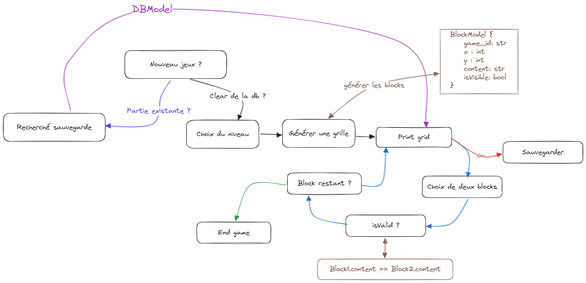

# Jeu de paires

## Principe du jeu : 
A chaque tour, l'utilisateur doit entrer les coordonnées (exemple A1 ou C7) pour révéler une carte, puis en entrer une autre afin te trouver la bonne paire, si les cartes sont identiques elles restent visibles sinon elles se retournent et le jeu continue.


## Étapes :
- Créer une grille avec les repérages en lignes / colonnes pour les coordonnées.
- Créer une structure de données pour le jeu.
- Gérer toutes les entrées clavier nécessaires au fonctionnement du jeu.
- Développer la logique du jeu qui vous parait la plus adaptée.
- Créez un fichier de configuration .yml dans lequel toute la configuration sera préalablement définie
- Implémenter une fonction pour sauvegarder la partie et une autre pour la charger.

**Bonus :** Instaurer un mode de difficulté (facile / difficile) permettant de gérer un nombres de coups maximum par niveau.

## Conditions :
- L'affichage se fait via la console, il faut gérer son effacement après chaque action.
- Gérer l'effacement du terminal après chaque action.
- Traiter toutes les exceptions des entrées utilisateur.
- La grille est identifiée par des nombres pour les lignes et des lettres pour les colonnes. (de 1 à 10 pour les lignes et de A à J pour les colonnes).
- La base de données est gérée avec la librairie tinydb.
- Le design pattern Memento permet de structurer l'architecture du système chargement / sauvegarde.
- Une nouvelle partie commence au niveau 0 (grille de 2 x 2) jusqu'au niveau 4.

__À chaque niveau, une taille de grille spécifique :__
- niveau 0 : 2 x 2
- niveau 1 : 4 x 4
- niveau 2 : 6 x 6
- niveau 3 : 8 x 8
- niveau 4 : 10 x 10

## Réfléxion personnel :



## Fichier de configuration

### Consigne :
Le fichier comprend les informations suivantes:
- grille_niveau :  taille de la grille par niveau
- recto : symboles pour la face visible des cartes
- verso : symbole du dos des cartes

### Exemple :
```yaml
niveau: [2, 4, 6, 8, 10]

recto: [" 😯", " 😀", " 😁", " 🤣", " 😉",
        " 😎", " 😍", " 🤗", " 🤩", " 😑",
        " 🙄", " 😣", " 😏", " 😮", " 🤐",
        " 😫", " 😴", " 😛", " 🤤", " 😓",
        " 🙃", " 🤑", " 🥵", " 🥶", " 😤",
        " 😭", " 🥳", " 😨", " 🤯", " 😱",
        " 🤪", " 😵", " 😡", " 🥺", " 😷",
        " 🤕", " 🤢", " 🤮", " 😇", " 🤠",
        " 🤥", " 🧐", " 😈", " 🤡", " 👻",
        " 🤘", " 🐍", " 🦆", " 🦁", " 🎮"]

verso: " ❓"
```


